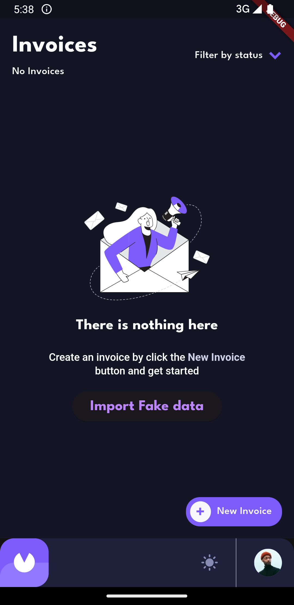
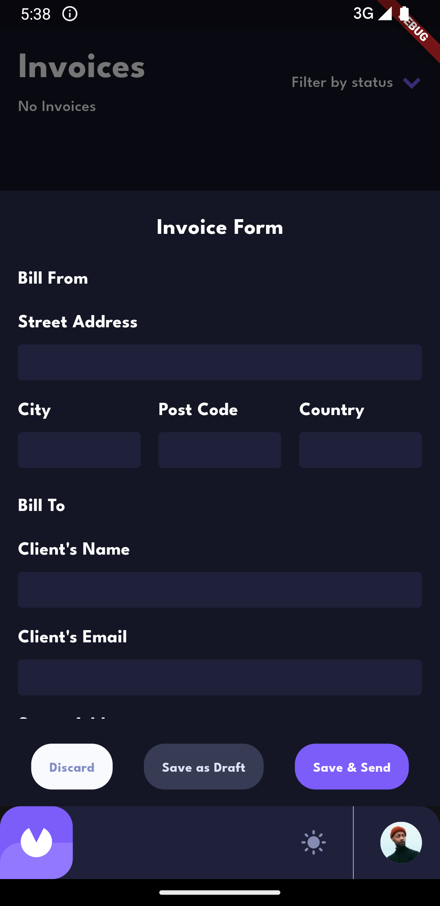
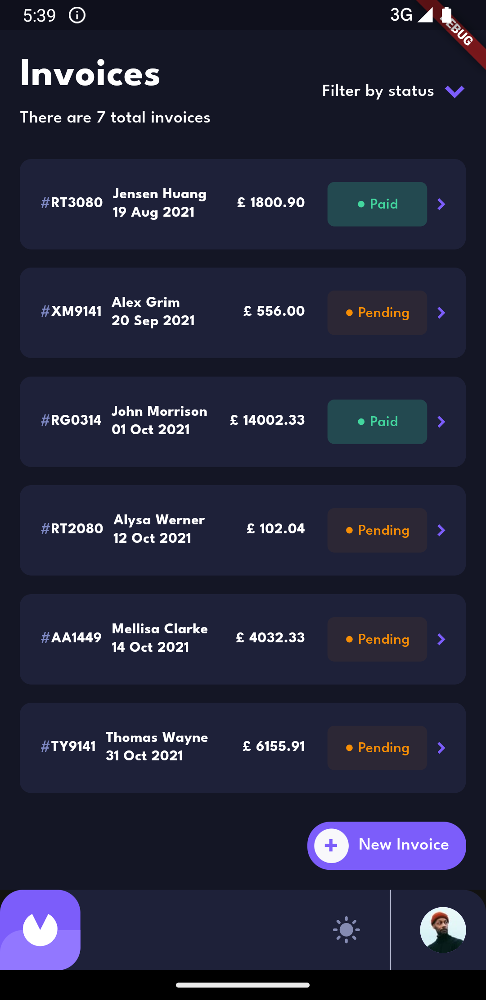
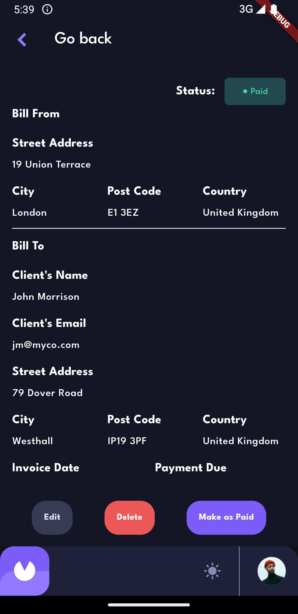
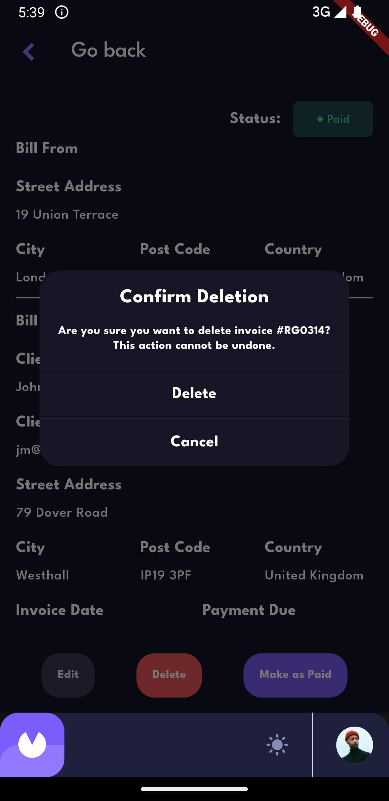
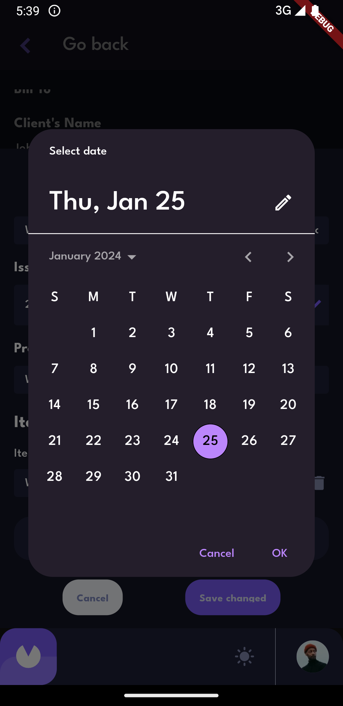

# invoice_app

Flutter SDK = 3.16.3

# Set up for Development

1. Make sure your computer and editor are ready for Flutter development

- <https://docs.flutter.dev/get-started/editor>

IDE:

- Android Studio
- Visual Studio Code

1. Import this project into your editor (ex: Android Studio, VS Code)

2. Install Fvm:
   Following: <https://fvm.app/docs/getting_started/installation>

3. Access the project's folder on Terminal and run the following command on its root:

```
fvm flutter pub get  
fvm flutter packages pub run build_runner build --delete-conflicting-outputs
```

4. Run app:

```
    fvm flutter run lib/main.dart
```

## Architecture & Development

Based on Clean Architecture.

## Dependency Injection

- Use [GetIt](https://pub.dev/packages/get_it) for repository and use case
- Use [Bloc](https://pub.dev/packages/flutter_bloc) for state management

## Screenshot

<div align="center">
         

</div>
